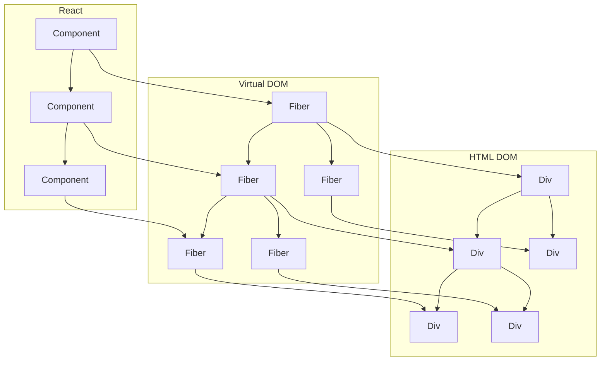

<article>
<h3 children={title}/>

<heading>
React VirtualDOM
</heading>

<Prompt date={date} />

It's hard to explain react data flow without first talking about the react's virtual dom.

The [React VirtualDOM](https://reactjs.org/docs/faq-internals.html)'s newest implementation is based on something the React team is calling `Fibers`. 

<section>

VirtualDOM is something of a misnomer, and implies it is somehow related to a [HTML DOM](https://www.w3schools.com/whatis/whatis_htmldom.asp). The HTML Document Object Model is a implementation detail, that can be swapped out like with React Native.

What the VirtualDOM is, is a process to update specific UI components based on some heuristic. React calls this process [reconciliation](https://reactjs.org/docs/reconciliation.html). React `Fibers` are the implementation of this reconciliation process.

</section>
 
React keeps track of components in a similar tree shaped structure to a regular. Only more complicated, it looks something like this



Parent components have children components. 
React provides hooks from each layer onto the next layer, using props.

The React virtual DOM does some optimizations here, such that if the props that go into a component don't change, then the component doesn't change, and the actual DOM doesn't need to be updated.

In order to pass props into a component, without having to pass that prop into the parent of the component as well, React provides [Context](https://reactjs.org/docs/context.html).

There are a few ways to imagine how props get injected into your component. There has been some hot debate in the office about which method should be preferred.

<section>

A **HOC**, or Higher order component, is a function that takes another function and returns another function. 

```jsx
function HOCExample(Component){
  const extraProps = {...}
  return (props)=><Component {...props} {...extraProps} />
}
```
The idea is to be able to inject props into the component and hide them from the parent component. 

Conceptually this is easy to understand, so far. 
The resulting component will obey the same rules as before regarding how the component renders and updates based on how these props are changing. 

Where React gets these extra props is another question. 

</section>

<section>


[react fiber](https://github.com/acdlite/react-fiber-architecture)

</section>

<section>

**Hooks** are a newer abstraction layer that doesn't use props. Although how props get passed through the virtual DOM is similar to how hooks access context 

</section>

<section>

Babel helps with the return value of your components. 

Using the JSX syntax, you might write a component that looks like this:
```js
const HelloWorld = ({name}) => <div>hello {name}!</div>
```

babel will transpile that into
```js
"use strict";

const HelloWorld = ({
  name
}) => React.createElement("div", null, "hello ", name, "!");
```

</section>


</article>