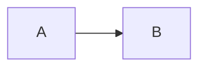
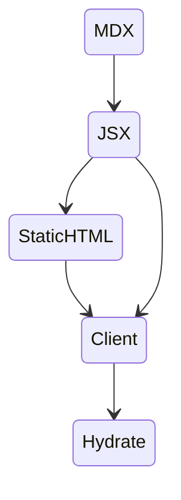

<h3 className="title" children={title}/>


<article>

<heading>

</heading>

<Prompt date={date}/> 

We're building a **Jamstack** log blog built with **React**,
**Typescript**, **MDX**, we're **SSR**ing the whole thing and
uploading it onto a **CDN** :rocket: 

<section>

I like the idea of name dropping a bunch of tech buzzwords at the beginning of blog posts, just get it out of the way. Also, **Jamstack** is a cool word.

You can read more about what a **Jamstack** is over at [jamstack.org](https://jamstack.org/)

</section>

Regular markdown is great, but do you know what would make
it even better? React. This is where **MDX** comes in,
which allows us to embed regular react components inside of
markdown.

<section>

Shout out to [`mermaid`](https://github.com/mermaid-js/mermaid), a library written in javascript on top of `dot` and `d3` that lets us write simple drawing commands in order to render beautiful graphs as simple svgs.

Code that looks like this
```
graph LR
A --> B
```

Gets rendered like this:


Mermaid has a bunch of options too, for rendering all different types of graphs and diagrams.

Give their online [live editor](https://mermaid-js.github.io/mermaid-live-editor) a shot, its pretty slick.

</section>


<asside>



</asside>

<heading>
MDX
</heading>

If we were using regular markdown things would be a little simpler, because everything can be staticly rendered,
shipped off to the client where we don't need to worry about it anymore. 

With MDX we can include interactive javascript elements as well, which need to be run on the client.
To do this, and keep the staticly generated benefits we want, we still need to render the static payload, and then
connect the javascript components after the initial render. 

React calls this process `hydration`. Basically creating two render paths, we're still rendering static markup on
the backend, at build time, but we need to keep some extra artifacts around that we can connect up later once
the client gets off the ground.


[**babel**](https://babeljs.io/)'s main job is to transform code from one shape into another shape.
Rewriting javascript functions on the fly. 
[**MDX**](https://github.com/mdx-js/mdx/tree/master/packages/mdx)'s 
compiler does some of this work for us, but we need to connect it up the rest of the way by hand.

```ts
export const renderToString = ({
  // a object with variables we want globally scoped
  scope = {}, 
  // components we're passing to the MDX Provider
  components = {}, 
  // markdown plugins
  remarkPlugins = [],
  rehypePlugins = [],
  // MDX Source
  source, 
}: Props): Result => {
  // MDX precompiler, including remark and rehype plugins
  // which should be pretty familiar if you've worked with
  // markdown before
  const jsx = mdx
    .sync(source, {
      remarkPlugins,
      rehypePlugins,
      skipExport: true,
    })
    .trim();

  // Run some additional babel transformations
  const code = transform(jsx, {
    objectAssign: "Object.assign",
  }).code;

  // We need to return the code used to generate the
  // static markup, we'll use this to hydrate the
  // component later.
  return {
    code,
    staticMDX: ReactDOMServer.renderToString(
      genReact({ code, components, scope })
    ),
    scope,
  };
};
```

JavaScript's [Function](https://developer.mozilla.org/en-US/docs/Web/JavaScript/Reference/Global_Objects/Function/Function)
interface lets us inject whatever we want into the scope for our component.
This is how we inject the meta data we pulled out of our `front-matter` files
into our react components.

```ts
const genReact = ({
  code,
  scope,
  components,
}: {
  code: string;
  scope: object;
  components: object;
}) => {
  const fullScope = {
    mdx: createElement,
    MDXProvider,
    components,
    ...scope,
  };

  const keys = Object.keys(fullScope);
  const values = Object.values(fullScope);

  // This is more or less the same transformation babel
  // might do for you whenever you're building a JSX
  // component, only modified for MDX.
  const fn = new Function(
    "React",
    ...keys,
    `${code}

// The mdx compiler created a MDXContent component
// in the local scope that we need to wrap with a
// MDXProvider so we can override the components
return React.createElement(MDXProvider, { components },
    React.createElement(MDXContent, {})
)
`);
  
  // render the component
  return fn(React, ...values);
};
```


Displaying the component is then a two stage process. 
Render the staticly generated HTML, then later on,
hydrate the actual react components.


```jsx
export const hydrate = ({
  code,
  staticMDX,
  components = {},
  scope = {},
}: HydrateProps) => {
  const hydrated = React.useRef(false);
  // create a div to hold our staticly rendered
  // string
  const [result, setResult] = React.useState(
    React.createElement("div", {
      dangerouslySetInnerHTML: {
        __html: staticMDX,
      },
    })
  );
  
  // Once the component loads, we ask window
  // for a idle callback, and hydrate our
  // actual react components
  typeof window !== "undefined" &&
    !hydrated.current &&
    window.requestIdleCallback(() => {
      const hydratedFn = genReact({ code, components, scope });

      hydrated.current = true;
      setResult(<div>{hydratedFn}</div>);
    });

  return React.useMemo(() => result, [code, result]);
};
```

<heading>
 Log Blog prompt
</heading>

A generic prompt that starts the narrative for the rest of the journal entry. We're already attaching meta data to each journal entry, using `front-matter`, which we can reference inside our MDX components. One of those meta data fields is called `date` and it holds the date the entry was published.

Then we can simply include the component in our MDX document:

```md
<Prompt date={date}/>
```

Which renders: 

<Prompt date={date}/>

<heading>
And beyond...
</heading>

At which point you can blog about being a starfleet captain or something, I don't know, I haven't gotten that far yet.


</article>

